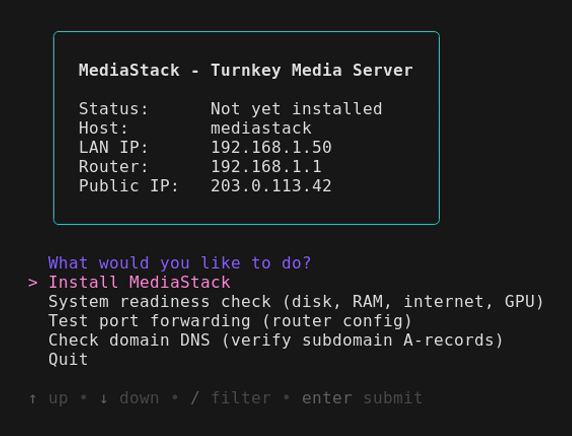
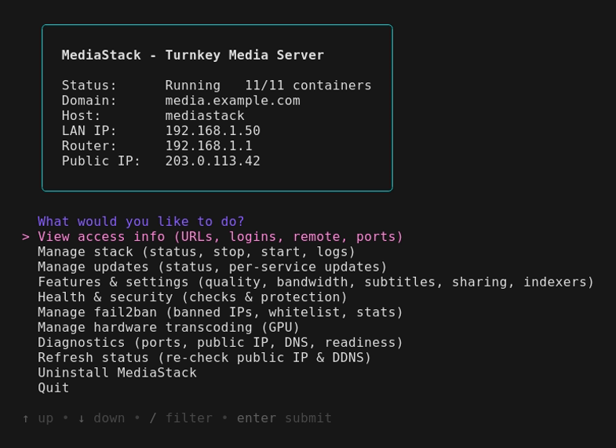

<div align="center">

Turnkey media server for home networks. Installs and configures the full stack on Debian from a single menu.

[](https://www.debian.org)
[](https://docs.docker.com/compose/)
[](https://github.com/famesjranko/MediaStack/actions/workflows/ci.yml)
[](#license)<br>

<!-- stable-image-badges:start -->
[](docs/operations/day-2.md)
<!-- stable-image-badges:end -->

</div>

MediaStack installs a home media stack on Debian: Jellyfin, Seerr, Sonarr, Radarr, qBittorrent, monitoring, remote access, and their supporting services. Everything runs through one command, `./mediastack`, for both install and day-2 management, and you never edit config files by hand.

---

## Quick Start

```bash
git clone https://github.com/famesjranko/MediaStack.git MediaStack
cd MediaStack
./mediastack
```

The installer detects the GPU, creates the storage layout (local, NAS/NFS, or manual), hardens the host, starts the containers, and configures every service through its API. Access URLs are printed at the end.

> [!NOTE]
> **Requirements:** Debian Server (headless), 50 GB+ free disk, internet connection.

> [!TIP]
> **Enhanced menus (optional):** run `./mediastack` → **Get enhanced menus** to install [gum](https://github.com/charmbracelet/gum) for arrow-key menus instead of numbered lists. The launcher detects it automatically.

> Prefer to script the install or skip the menu? See [Direct CLI Usage](#direct-cli-usage).

---

## The `./mediastack` menu

`./mediastack` adapts to the machine state. It refuses to run as root, and uses arrow-key menus when `gum` is installed, numbered lists otherwise.

**Before install**



| Menu item | What it does |
|:----------|:-------------|
| Install MediaStack | Runs the full installer (`setup.sh`) |
| System readiness check | Checks disk, RAM, internet, and GPU; changes nothing |
| Test port forwarding | Checks that the required router ports reach this box |
| Check domain DNS | Verifies that your subdomain A-records resolve to your IP |

**After install: the day-2 menu**



This is the main tool once the stack is running. Each item is documented in depth in [`docs/operations/day-2.md`](docs/operations/day-2.md).

| Menu item | What it does |
|:----------|:-------------|
| View access info | Service URLs, logins, and ports; reveals the admin password on request |
| View storage & data mount | NAS source, mount health, and watchdog state; re-check now |
| Manage stack | Service status; stop/start one service or all; tail logs |
| Manage updates | Per-service update status; update one or all; revert a service to its installed image |
| Features & settings | Toggle subtitles, SMB share, indexers, firewall, and hardening; change quality profile; adjust bandwidth; add remote access |
| Health & security | Run checks: fail2ban regex/jails, TLS expiry, DNS drift, disk %, and the UFW + Docker port lock |
| Manage fail2ban | Banned IPs (pick one to unban, or unban and always-allow); manage the whitelist; per-jail stats and history |
| Manage hardware transcoding (GPU) | Configure or change transcoding; NVIDIA driver/patch upkeep |
| Diagnostics | Port-forward test, DNS check, readiness, and a connection speed test |
| Uninstall MediaStack | Removes recorded host changes; keeps `data/` and `config/` |

> Some items appear only when they apply: **View storage** and the **NAS watchdog** toggle on NAS installs; **Add remote access** only before remote access is configured; the **NVIDIA driver / Unlock patch** items only on an NVIDIA Unlock install.

Power-user paths with no menu equivalent (hand-editing `config.yml`, image pruning, raw `docker compose`) are covered under [Direct CLI Usage](#direct-cli-usage).

---

## Services & Ports

MediaStack runs 19 containers. The default services start automatically. Remote access adds the `proxy` and `remote` profiles, subtitles adds Bazarr, and the `autoheal` sidecar runs by default (opt out with `AUTOHEAL_ENABLED=false` in `.env`).

| Service | Port | Purpose | Profile |
|:--------|:-----|:--------|:--------|
| Homepage | 3000 | Dashboard with API widgets | default |
| Jellyfin | 8096 | Media server | default |
| Sonarr | 8989 | TV show management | default |
| Radarr | 7878 | Movie management | default |
| Jackett | 9117 | Torrent indexer proxy | default |
| qBittorrent | 8080 | Torrent client | default |
| FlareSolverr | 8191 | Cloudflare bypass | default |
| Seerr | 5055 | Media requests | default |
| Unpackerr | - | Extract archived downloads | default |
| Portainer | 9000 | Container management UI | default |
| NPM | 80/443/81 | Reverse proxy + SSL | proxy |
| Fail2ban | - | Brute-force protection | proxy |
| Uptime Kuma | 3001 | Service health monitoring | default |
| WireGuard | 51820/51821 | VPN with web UI | remote |
| Bazarr | 6767 | Subtitle management | subtitles |
| DDNS Updater | 8000 | Dynamic DNS | proxy |
| Beszel Hub | 8090 | System resource dashboard | default |
| Beszel Agent | 45876 | Host metrics collector | default |
| Autoheal | - | Restart unhealthy containers | autoheal |

---

## Auto-Configuration

Setup configures each service through its HTTP API, so the stack works immediately after install.

| Service | What gets configured |
|:--------|:---------------------|
| **qBittorrent** | Download paths, categories (`tv-sonarr`, `radarr`), speed limits, queueing |
| **Jackett** | FlareSolverr URL, admin password, indexers from `config.yml` |
| **Sonarr** | Root folder, qBittorrent client, quality profile (resolution × size; pick in the wizard), per-tier file-size bounds, naming, optional Torznab indexers |
| **Radarr** | Same as Sonarr for movies; Remux excluded across all cells (see [`docs/reference/quality-bounds.md`](docs/reference/quality-bounds.md)) |
| **Bazarr** | Connected to Sonarr + Radarr, English profile *(subtitles profile only)* |
| **Jellyfin** | Admin account, Movies + TV libraries, hardware transcoding from hardware probes |
| **Seerr** | Connected to Jellyfin + Sonarr + Radarr, admin approval, per-user quotas |
| **Portainer** | Admin user, local Docker endpoint |
| **Homepage** | Service groups with API widgets |
| **Uptime Kuma** | Admin account, HTTP monitors, status page, Homepage widget |
| **NPM** | Admin credentials, proxy hosts for `jellyfin.$DOMAIN` and `seerr.$DOMAIN` |
| **WireGuard** | wg-easy admin credentials, endpoint, access tier, one initial peer *(remote profile only)* |

Admin UIs use the setup admin username and password (`JELLYFIN_ADMIN_USER` / `JELLYFIN_ADMIN_PASSWORD`); NPM and Beszel use the setup admin email (`NPM_ADMIN_EMAIL`) with the same password. API keys are auto-discovered and saved to `.env`.

> [!IMPORTANT]
> MediaStack ships with no public trackers enabled. Add indexers only where you have the legal right to use them. The optional preset is available in the wizard and as `config/examples/public-indexers.yml`.

> [!NOTE]
> Media you request through Seerr uses the quality profile you picked (default `1080p Balanced`). MediaStack sets it as Seerr's default profile for Sonarr and Radarr. Only if you add a series/movie **directly** in the Sonarr/Radarr UI do you choose the profile yourself (their built-in default is "Any").

To change the quality profile, use the menu (**Features & settings → Change quality profile**). Other config changes after hand-editing `config.yml` are covered under [Direct CLI Usage](#direct-cli-usage).

---

## After Install

Everything is wired together before setup exits.

1. Open Homepage at `http://<ip>:3000`, the main LAN dashboard. It links Jellyfin, Seerr, downloads, automation, and monitoring.
2. Use Seerr to request a show or movie.
3. Watch it in Jellyfin after automation completes.

For daily use, create a separate Jellyfin account per person instead of sharing the admin login.

<details>
<summary><strong>Family accounts (Jellyfin + Seerr)</strong></summary>

<br>

| Person | Jellyfin role | Seerr role |
|:-------|:--------------|:-----------|
| Parent | Admin if they maintain the server | Request approver / auto-approve |
| Kid | Normal user with age/library limits | Request-only; admin approval required |

Jellyfin and Seerr permissions are independent: Jellyfin admin covers libraries, users, and server settings; Seerr covers requests and approvals. Add Jellyfin users under Dashboard → Users, and grant Seerr request-management per user after their first sign-in.

> [!NOTE]
> By default Seerr request limits are `0` movies / `0` series per 7 days. In Seerr, `0` means unlimited but not auto-approved; each request still needs approval. To cap this, set `seerr.quotas` in `config.yml` (e.g. 5/5) and reconcile (see [Direct CLI Usage](#direct-cli-usage)). Parent accounts skip approval via auto-approve permissions.

</details>

---

## Data Layout

MediaStack follows [TRaSH Guides](https://trash-guides.info/File-and-Folder-Structure/) so completed downloads hardlink into the media library.

```text
/data/
|-- torrents/          # Download client writes here
|   |-- movies/
|   `-- tv/
`-- media/             # Organized media library
    |-- movies/        # Hardlinked from torrents/
    `-- tv/
```

> [!TIP]
> Hardlinks mean files appear in both `torrents/` and `media/` without using double the disk space. Removing a finished torrent never deletes the library copy, because both paths name the same underlying file. Both directories must be on the same filesystem.

---

## LAN File Sharing (SMB)

Enable an SMB share from `./mediastack` → **Features & settings → File sharing (SMB)** to browse and manage media from other devices on your network.

| Share | Maps to | Use for |
|:------|:--------|:--------|
| `Media` | `DATA_DIR` | Media browsing and file management |
| `MediaStackSystem` | `/` | Advanced full-filesystem access only |

- **Connect:** Windows `\\<server-ip>\Media` · macOS/Linux `smb://<server-ip>/Media`
- **Credentials:** same admin username and password as the other services
- **Security:** LAN-only. UFW restricts port 445 to private networks

---

## Remote Access

Remote access needs a domain name and port forwarding. Enable it from `./mediastack` → **Features & settings → Add remote access**. Setup then creates the reverse-proxy hosts, requests Let's Encrypt certificates, applies security headers, and enables Seerr proxy-trust.

| Access type | What's exposed | Protected by |
|:------------|:---------------|:-------------|
| Internet (HTTPS) | Jellyfin, Seerr | NPM reverse proxy + Let's Encrypt + fail2ban |
| LAN only | All admin UIs | Router ports not forwarded |
| VPN (WireGuard) | Set by the peer's access tier (see below) | WireGuard + admin password |

**1. Get a domain.** `jellyfin.<domain>` and `seerr.<domain>` need to resolve to your home IP.

- **No domain, or a changing (dynamic) IP:** pick a free-hostname DDNS provider when the installer asks — **[Dynu](https://www.dynu.com/), DuckDNS, deSEC, or dynv6** — and enter its credentials; MediaStack keeps the hostname pointed at your current IP. Finish HTTPS from **Add remote access** once DNS resolves.
- **Your own domain (Cloudflare or Porkbun):** enter your API credentials so MediaStack manages the records, or point A records for `jellyfin.` and `seerr.` at your public IP yourself and choose **skip DDNS** when the installer asks.

**2. Forward ports** to your server's LAN IP (`hostname -I`; use a static IP or DHCP reservation):

| Port | Protocol | Purpose |
|:-----|:---------|:--------|
| 80 | TCP | Let's Encrypt validation + HTTP→HTTPS redirect |
| 443 | TCP | HTTPS for Jellyfin and Seerr |
| 6881 | TCP+UDP | qBittorrent peers |
| 51820 | UDP | WireGuard VPN |

> [!WARNING]
> **Forward only the four ports listed above.** Every other port (admin UIs, and especially NPM admin `81` and the wg-easy admin UI `51821`) must stay LAN-only. Jellyfin and Seerr reach the internet through the reverse proxy on 443, not their own ports.

**3. Enable remote access** via the menu above. If certificate issuance fails (DNS not pointed yet, or port 80 not forwarded), a `[WARN]` is logged and the proxy serves HTTP. Request certs later in the NPM UI at `http://<ip>:81`.

**4. Verify** from outside your network (e.g. phone on cellular): `https://jellyfin.<domain>` and `https://seerr.<domain>` should load with an HTTPS lock.

### WireGuard VPN

Choose remote access during setup, or add it later from the menu. wg-easy starts with your admin credentials and one initial peer, named after your admin user and set to the access tier you picked at install. Sign in at Homepage → WireGuard (Network group) with your admin username and password.

Create one peer per person with **New Client** in the wg-easy UI. For phones, scan the peer's QR code in the WireGuard app; for laptops, download and import its `.conf`. Deleting a peer revokes every device using it, so treat QR codes and `.conf` files like passwords. WireGuard uses your base domain and UDP port (e.g. `yourdomain.com:51820`); forward only that UDP port. For the full list of per-client settings, see wg-easy's [client guide](https://wg-easy.github.io/wg-easy/latest/guides/clients/).

> [!NOTE]
> **Access tiers.** Normal internet traffic never routes through MediaStack; the tier only controls what a peer can reach on your network. During setup you choose the level for **your own first peer (your admin device)**, and most people leave it Full LAN:
> - **Full LAN**: every device on your home network. Best for your own admin device.
> - **Server**: this box on every port (apps plus host services like SSH). For a co-admin.
> - **Containers**: MediaStack app ports only, no host services or other LAN devices.
>
> Two lower-trust **Streaming** levels are not installer choices, just manual templates (below) for the extra peers you add yourself: **Streaming** (Jellyfin only, for watch-only peers like kids) and **Streaming + requests** (Jellyfin + Seerr, for peers who also request titles). Neither exposes Homepage.
>
> Tiers are enforced on the server, so a peer can't widen its own access by editing its device's config.
>
> If a peer behind strict NAT (cellular, hotel Wi-Fi) keeps dropping, set **Persistent Keepalive** to `25` in wg-easy.

<details>
<summary><strong>wg-easy per-tier "Firewall Allowed IPs" templates</strong></summary>

<br>

Your own first peer already has the access level you chose at setup. You only need these templates for the **extra people you add yourself** in the wg-easy web UI. New peers start with an empty **Firewall Allowed IPs** field (no access). Paste one template into that field, replacing `<server>` with the box's LAN IP and `<lan-cidr>` with your LAN range (e.g. `192.168.1.0/24`):

**Full LAN:**
```text
<lan-cidr>
```
**Server** (this box, all ports incl. SSH):
```text
<server>/32
```
**Containers** (apps only, no host SSH/SMB or wg-easy UI):
```text
<server>:80/tcp,<server>:81/tcp,<server>:443/tcp,<server>:3000/tcp,<server>:3001/tcp,<server>:5055/tcp,<server>:6767/tcp,<server>:7359/udp,<server>:7878/tcp,<server>:8000/tcp,<server>:8080/tcp,<server>:8090/tcp,<server>:8096/tcp,<server>:8191/tcp,<server>:8989/tcp,<server>:9000/tcp,<server>:9117/tcp
```
**Streaming** (Jellyfin only, watch-only):
```text
<server>:8096/tcp
```
**Streaming + requests** (Jellyfin + Seerr):
```text
<server>:8096/tcp,<server>:5055/tcp
```

Set the client-side **Allowed IPs** to match: `<lan-cidr>` for Full LAN, `<server>/32` for the others. The Firewall field takes IP/CIDR with optional `:port/proto`; hostnames are not supported.

</details>

**Advanced: full-tunnel routing** (routing every device's internet traffic through your home VPN, rare for media-server use) bypasses the access-tier model entirely — see the "Advanced — full-tunnel routing" note in [`docs/setup/configuration-schema.md`](docs/setup/configuration-schema.md) for the `.env` settings.

<details>
<summary><strong>Security details</strong></summary>

<br>

The security model (UFW default-deny, NPM + Let's Encrypt, fail2ban, kernel hardening, VPN tiers) is described in [`docs/design/architecture.md`](docs/design/architecture.md#security-layer). Operational notes:

- **Admin UIs are firewall-restricted to your LAN and VPN range**, so they aren't reachable from the internet even with ports open.
- **HSTS:** once a browser sees the header it refuses plain HTTP for all subdomains, so configure SSL before adding new subdomains.
- **Unban an IP:** run `./mediastack` → **Manage fail2ban** → **Banned IPs**, pick the address, then **Unban** to release it across every jail (no need to shell into the container).

</details>

---

## GPU Transcoding

Setup auto-detects your GPU and offers hardware transcoding when you opt in; encoding settings are set from real hardware probes and verified with a short in-container FFmpeg encode. Manage it later from `./mediastack` → **Manage hardware transcoding (GPU)**.

| GPU | What setup does |
|:----|:----------------|
| **NVIDIA** | **Standard** (recommended): Debian driver + nvidia-container-toolkit, NVENC in Jellyfin. **Unlock NVENC limit** (advanced opt-in): patch-managed driver + [nvidia-patch](https://github.com/keylase/nvidia-patch) to remove the session cap |
| **AMD** | Mesa VAAPI drivers, `/dev/dri` passthrough, VAAPI in Jellyfin |
| **Intel** | Intel media drivers, `/dev/dri` passthrough, QSV with VAAPI fallback |
| **None** | Software transcoding, no extra config |

**Standard** keeps NVIDIA's NVENC session limit (typically 3 to 5 transcodes) and updates with `apt`. **Unlock** removes the cap but modifies driver binaries (which may conflict with NVIDIA's terms) and must be re-patched after each driver update (from **Manage hardware transcoding (GPU)**; see [`docs/operations/day-2.md`](docs/operations/day-2.md)). On NVIDIA installs, MediaStack recovers automatically if the GPU runtime goes stale.

---

## Maintenance

Update service images from `./mediastack` → **Manage updates**. It shows each container's status (up to date / update available / not installed) and lets you update one service or all, revert a service to its installed image, or re-check now. WireGuard is excluded from "Update all" because updating it restarts remote access. Update it on its own via **Update a service**, from your LAN.

The wizard asks which image versions to **install** with. This is an install-time choice, not an auto-updater; nothing updates on its own:

| Channel | Default | Installs with |
|:--------|:--------|:--------------|
| Stable | Yes | MediaStack-tested digests from [`docs/operations/image-digests.lock`](docs/operations/image-digests.lock) (the versions the installer was verified against) |
| Latest | No | Current upstream tags from `docker-compose.yml` |

Stable is recommended: it installs the versions tested end-to-end. Latest installs the newest upstream tags. To change channel later, re-run the installer and pick the other. There is no automatic rollback, so updates leave old image layers until you prune them. See [`docs/operations/image-updates.md`](docs/operations/image-updates.md#stable-vs-latest) for the rationale.

Portainer can show update indicators, but for a normal install the supported update path is **Manage updates**. Use Portainer for visibility, logs, restarts, and troubleshooting.

---

## Troubleshooting

| Symptom | Check |
|:--------|:------|
| Services will not start | `docker compose ps` / `docker compose logs <service>` |
| Permission errors | `sudo chown -R $(id -u):$(id -g) /data` |
| Hardlinks not working | `df /data/torrents /data/media` (both must be on one filesystem) |
| GPU not working (NVIDIA) | `nvidia-smi`; `docker exec jellyfin nvidia-smi` |
| GPU not working (AMD/Intel) | `ls -la /dev/dri/`; `vainfo` |

| Remote symptom | Likely cause |
|:---------------|:-------------|
| "Certificate request failed" | DNS not pointing to your IP, or port 80 not forwarded |
| Cannot reach site from outside | Port 443 not forwarded, or DNS not propagated (`dig jellyfin.<domain>`) |
| Works on LAN but not remote | Router port forwarding not set, or ISP blocking ports |
| Need manual cert | NPM UI → SSL → Add Certificate → Let's Encrypt |

For reboot recovery, a broken Jellyfin wizard state, or an NPM lockout, see [`docs/operations/day-2.md`](docs/operations/day-2.md) (**Recovery**).

---

## Direct CLI Usage

The `./mediastack` menu is the recommended way to install and run everything below, and a normal install never needs these. The scripts are here for power users and automation.

| Command | Purpose | Docs |
|:--------|:--------|:-----|
| `./setup.sh` · `./setup.sh --full` | Install without the menu (`--full` also installs Docker on bare Debian) | [setup-flow](docs/setup/setup-flow.md#setupsh--install-flow) |
| `./setup.sh --remote` | Add **or repair** remote access (repairing an already-configured setup has no menu equivalent) | [setup-flow](docs/setup/setup-flow.md#setupsh--install-flow) |
| `./setup.sh --transcoding` | Re-verify hardware transcoding | [setup-flow](docs/setup/setup-flow.md#setupsh--install-flow) |
| `./scripts/configure.sh [--only svc,…]` | Reconcile services after hand-editing `config.yml` (quotas, indexers, paths) | [day-2](docs/operations/day-2.md#re-running-configuresh-after-editing-configyml) |
| `./scripts/update.sh [--prune]` | Pull and recreate images; `--prune` also clears dangling layers | [day-2](docs/operations/day-2.md#scriptsupdatesh) |
| raw `docker compose …` | Service status, logs, restart, manual profile control | [day-2](docs/operations/day-2.md#day-2-ops) |

The menu's **Manage stack** is the safe path (it starts the correct compose profiles). Raw equivalents:

```bash
docker compose ps                            # service status
docker compose logs -f jellyfin              # follow logs
docker compose restart sonarr                # restart one service
docker compose --profile proxy --profile remote --profile subtitles --profile autoheal up -d   # start optional profiles (drop any you didn't enable)
```

> [!NOTE]
> A bare `docker compose up -d` starts only the default profile: it will not bring up remote access, subtitles, or autoheal.
>
> To rename the quality profile, use the menu (**Features & settings → Change quality profile**), not a raw `configure.sh` re-run, which would leave an orphaned profile.

---

## Documentation

| Document | Purpose |
|:---------|:--------|
| [`docs/operations/day-2.md`](docs/operations/day-2.md) | Day-2 menu operations, updates, features, recovery |
| [`docs/operations/image-updates.md`](docs/operations/image-updates.md) | Stable/Latest channels and image update policy |
| [`docs/reference/quality-bounds.md`](docs/reference/quality-bounds.md) | Quality profiles and per-tier file-size bounds |
| [`docs/design/architecture.md`](docs/design/architecture.md) | Service graph, network shape, security layer, data layout |
| [`docs/setup/setup-flow.md`](docs/setup/setup-flow.md) | Setup phases, GPU handling, reboot/resume behavior |
| [`docs/setup/configure-flow.md`](docs/setup/configure-flow.md) | API-driven service configuration flow |
| [`docs/project/stack.md`](docs/project/stack.md) | Runtime, services, commands, and host dependencies |
| [`docs/project/structure.md`](docs/project/structure.md) | Directory tree, placement rules, and service-add workflow |
| [`tests/README.md`](tests/README.md) | DinD harness, scenarios, and verification workflow |
| [`docs/README.md`](docs/README.md) | Full architecture docs index and reading order |

---

## Contributing

Bug reports, feature ideas, and pull requests are welcome. Start with
[`CONTRIBUTING.md`](CONTRIBUTING.md).

---

## License

MediaStack is source-available under the [PolyForm Noncommercial License 1.0.0](LICENSE)

Non-commercial use is permitted. Commercial use requires prior written permission from Andrew Mcdonald.

SPDX-License-Identifier: PolyForm-Noncommercial-1.0.0
