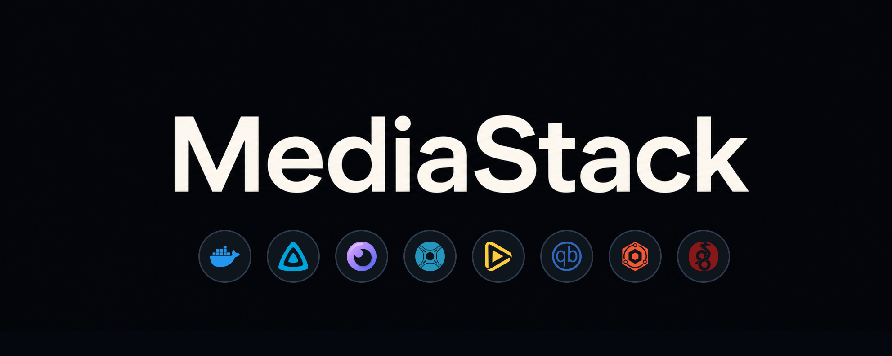

<div align="center">

Turnkey media server for home networks. One command takes bare Debian to a fully configured stack.

[](https://www.debian.org)
[](https://docs.docker.com/compose/)
[](#license)

<!-- stable-image-badges:start -->
[](docs/operations/image-digests.lock)
[](docs/operations/image-digests.lock)
[](docs/operations/image-updates.md)
[](docker-compose.yml)
<!-- stable-image-badges:end -->

</div>

MediaStack turns a fresh Debian server into a complete home media stack: Jellyfin, Seerr, Sonarr, Radarr, qBittorrent, monitoring, remote access, and the supporting services they need. It is designed for non-technical users who should not have to edit service config files by hand.

`./mediastack` opens the guided launcher. `setup.sh --full` installs Docker, detects GPU hardware, creates the storage layout, hardens the host, starts the containers, and wires services together through their APIs. Storage can be local, managed NFS/NAS, or advanced manual. `config.yml` remains the source of truth for what gets configured.

---

## Quick Start

```bash
git clone https://github.com/famesjranko/MediaStack.git MediaStack
cd MediaStack
./mediastack
```

`./mediastack` adapts to the machine state: before install it shows setup and readiness checks; after install it shows status, port checks, updates, hardware transcoding, and troubleshooting.

> [!NOTE]
> **Requirements:** Debian Server (headless), 50 GB+ free disk space, internet connection.

<details>
<summary><strong>Scripted / automation install</strong></summary>

<br>

Run setup directly if you do not want the launcher menu:

```bash
./setup.sh --full     # bare Debian: installs Docker + MediaStack
./setup.sh            # Docker already installed
```

`./setup.sh` auto-detects whether Docker is installed and offers to install it if missing. Both paths reach the same wizard.

</details>

<details>
<summary><strong>What setup.sh does</strong></summary>

<br>

1. Checks prerequisites
2. Detects GPU hardware and offers optional Jellyfin hardware transcoding
3. Applies OS hardening (UFW firewall, automatic security updates, kernel hardening)
4. Creates the `/data` directory structure
5. Generates `.env` interactively, including local/NAS storage protection and managed/manual app path wiring
6. Optionally configures SMB file sharing for LAN access
7. Starts all services
8. Auto-configures services through their APIs
9. Prints access URLs

</details>

---

## What You Get

| Capability | Included |
|:-----------|:---------|
| Media streaming | Jellyfin with Movies and TV Shows libraries |
| Requests | Seerr connected to Jellyfin, Sonarr, and Radarr |
| Automation | Sonarr, Radarr, Jackett, FlareSolverr, qBittorrent, Unpackerr |
| Dashboard | Homepage widgets for queues, stats, and download speeds |
| Monitoring | Uptime Kuma plus Beszel resource dashboards |
| Remote access | NPM reverse proxy, Let's Encrypt, fail2ban, optional WireGuard |
| Transcoding | NVIDIA NVENC, Intel QSV/VAAPI, AMD VAAPI, or software fallback |
| File access | Optional LAN-only SMB share for media management |

```text
Bare Debian
    |
    v
./mediastack
    |
    +-- setup wizard
    +-- Docker Compose stack
    +-- API auto-configuration
    +-- access URLs for every service
```

---

## Services

MediaStack runs 19 containers. The default stack starts automatically; optional compose profiles are enabled when you choose remote access, subtitles, or auto-healing.

<details>
<summary><strong>Full service list</strong></summary>

<br>

| Service | Port | Purpose | Profile |
|:--------|:-----|:--------|:--------|
| Homepage | 3000 | Dashboard with API widgets | default |
| Jellyfin | 8096 | Media server | default |
| Sonarr | 8989 | TV show management | default |
| Radarr | 7878 | Movie management | default |
| Jackett | 9117 | Torrent indexer proxy | default |
| qBittorrent | 8080 | Torrent client | default |
| FlareSolverr | 8191 | Cloudflare bypass | default |
| Seerr | 5055 | Media requests | default |
| Unpackerr | - | Extract archived downloads | default |
| Portainer | 9000 | Container management UI | default |
| NPM | 80/443/81 | Reverse proxy + SSL | proxy |
| Fail2ban | - | Brute-force protection | proxy |
| Uptime Kuma | 3001 | Service health monitoring | default |
| WireGuard | 51820/51821 | VPN with web UI | remote |
| Bazarr | 6767 | Subtitle management | subtitles |
| DDNS Updater | 8000 | Dynamic DNS | proxy |
| Beszel Hub | 8090 | System resource dashboard | default |
| Beszel Agent | 45876 | Host metrics collector | default |
| Autoheal | - | Restart unhealthy containers | autoheal |

</details>

---

## Auto-Configuration

The setup script configures services through their HTTP APIs so the stack is usable after install without clicking through every app manually.

| Service | What gets configured |
|:--------|:---------------------|
| **qBittorrent** | Download paths, categories (`tv-sonarr`, `radarr`), speed limits, queueing |
| **Jackett** | FlareSolverr URL, admin password, configured indexers from `config.yml` |
| **Sonarr** | Root folder, qBittorrent download client, `1080p Balanced` quality profile (resolution × size; pick in the wizard), per-tier file-size bounds, naming conventions, optional Torznab indexers |
| **Radarr** | Same as Sonarr for movies; Remux excluded across all cells, see [`docs/reference/quality-bounds.md`](docs/reference/quality-bounds.md) |
| **Bazarr** | Connected to Sonarr + Radarr, English language profile *(subtitles profile only)* |
| **Jellyfin** | Admin account, Movies + TV Shows libraries, hardware transcoding based on hardware probes |
| **Seerr** | Connected to Jellyfin + Sonarr + Radarr, admin approval required, per-user request quotas |
| **Portainer** | Admin user created, local Docker endpoint configured |
| **Homepage** | Service groups with API widgets |
| **Uptime Kuma** | Admin account, HTTP monitors for all services, status page, Homepage widget |
| **NPM** | Admin credentials, proxy hosts for `jellyfin.$DOMAIN` and `seerr.$DOMAIN` |
| **WireGuard** | wg-easy admin credentials, endpoint settings, access tier, and one initial peer named after the setup admin user *(remote profile only)* |

Most configured admin UIs use the setup admin username and password (`JELLYFIN_ADMIN_USER` / `JELLYFIN_ADMIN_PASSWORD`). NPM and Beszel use the setup admin email (`NPM_ADMIN_EMAIL`) with the same password. WireGuard's wg-easy UI uses the setup admin username and password. API keys are auto-discovered and saved to `.env`.

<details>
<summary><strong>Re-running configure.sh</strong></summary>

<br>

`./scripts/configure.sh` is idempotent and safe to re-run:

- **Adds** new resources from `config.yml` that are not in live services yet
- **Warns** when an existing resource has drifted from `config.yml`; drift is not reconciled automatically

To apply changes to existing resources, rebuild:

```bash
docker compose down -v    # wipes containers + volumes (bind-mounted config dirs survive)
./setup.sh --full         # re-runs setup from scratch
```

This preserves your media library under `/data` but re-seeds service state. Automated reconciliation is deliberately avoided because it can orphan series, destroy watch history, or disrupt downloads.

</details>

---

## After Install

Everything is wired together before setup exits.

1. Open Homepage at `http://<ip>:3000`
2. Use Seerr to request a show or movie
3. Watch it in Jellyfin after automation completes

Homepage is the day-to-day front door on your LAN. It links to Jellyfin, Seerr, downloads, automation, and monitoring from one page.

<details>
<summary><strong>What was configured behind the scenes</strong></summary>

<br>

- Homepage dashboard with API widgets for all services
- Jellyfin admin account + Movies/TV libraries
- Jackett admin password + optional indexers from `config.yml`
- Sonarr/Radarr download client, root folders, quality profiles, per-tier file-size bounds, TRaSH naming conventions, optional indexer connections
- Seerr connected to Jellyfin, Sonarr, and Radarr
- Unpackerr restarted with API keys
- qBittorrent categories, paths, and limits

> [!NOTE]
> The quality profile you pick (default `1080p Balanced`) is created but not set as the per-show default. Sonarr/Radarr default each new series/movie to "Any"; change this in Settings > Profiles if you want a different default.

> [!IMPORTANT]
> MediaStack ships with no public trackers enabled by default. Add indexers only where you have the legal right to use them. The optional preset is available through the setup wizard and as `config/examples/public-indexers.yml`.

</details>

---

## Family Users

Setup creates one admin/owner account so the stack can configure itself. For daily use, create a separate Jellyfin account for each person in the household instead of sharing the admin login.

A typical family setup:

| Person | Jellyfin role | Seerr role |
|:-------|:--------------|:----------------|
| Parent 1 | Admin if they maintain the server | Request approver, no quota, or auto-approve |
| Parent 2 | Admin only if needed | Request approver, no quota, or auto-approve |
| Kid 1 | Normal user with age/library limits | Request-only; admin approval required |
| Kid 2 | Normal user with age/library limits | Request-only; admin approval required |

Jellyfin and Seerr permissions are separate. Jellyfin admin rights let someone manage libraries, users, playback settings, and server configuration. Seerr permissions control requests, approvals, auto-approval, and request limits. A parent can approve Seerr requests without also being a Jellyfin admin. If you want a parent account to be an admin in both apps, make that user an administrator in Jellyfin and grant admin or request-management permissions in Seerr after their first Seerr sign-in.

### Add Jellyfin users

1. Open Homepage, then Jellyfin.
2. Sign in with the admin account from setup.
3. Go to Dashboard > Users, then click the `+` / Add User button.
4. Create one user per person.
5. Leave administrator access off for kids and anyone who should not manage the server.
6. For kids, restrict library access, ratings, and any content controls you want Jellyfin to enforce.

### Give parents request control

1. Have each parent sign in to Seerr once with their Jellyfin account, or import Jellyfin users from Seerr's Users page.
2. Sign in to Seerr with the setup admin/owner account.
3. Open Users, edit the parent account, and grant the request-management or admin permissions you want them to have.
4. If trusted parent requests should not wait for approval, enable the relevant auto-approve permissions for that parent.
5. If parent accounts should not be limited, override or remove their movie and series request limits in Seerr.

Seerr permission labels can vary by version. Look for settings named like Admin, Manage Requests, Auto-Approve, and request limits.

For kids, leave the default Seerr permissions alone unless you intentionally want a different rule. MediaStack configures new Seerr users as request-only by default, with admin approval required.

By default, MediaStack sets Seerr request limits to `0` movies and `0` TV series per 7 days. In Seerr, `0` means unlimited requests. That does not mean auto-approved: a request-only user can ask for unlimited items, but each request still waits for a parent/admin to approve it. To add a real cap, edit `config.yml` under `seerr.quotas`, for example 5 movies and 5 TV series per 7 days, then re-run `./scripts/configure.sh`. Parent accounts can avoid approval by using auto-approve permissions. If you enable quotas but want parents to stay unlimited, set per-user request-limit overrides for those parent accounts in Seerr.

Keep the original setup admin account as the owner/break-glass account. Use personal parent accounts for day-to-day watching and request approval.

---

## Data Layout

MediaStack follows [TRaSH Guides](https://trash-guides.info/File-and-Folder-Structure/) so completed downloads can hardlink into the media library.

```text
/data/
|-- torrents/          # Download client writes here
|   |-- movies/
|   `-- tv/
`-- media/             # Organized media library
    |-- movies/        # Hardlinked from torrents/
    `-- tv/
```

> [!TIP]
> Hardlinks mean files appear in both `torrents/` and `media/` without using double the disk space. Removing a finished torrent never deletes the library copy — both paths are names for the same underlying file, so dropping one keeps the other intact. Both directories must be on the same filesystem.

---

## Remote Access

A domain name, port forwarding, and MediaStack does the rest. `configure.sh` auto-creates reverse proxy hosts, requests SSL certificates, and applies security headers.

| Access type | What's exposed | Protected by |
|:------------|:---------------|:-------------|
| Internet (HTTPS) | Jellyfin, Seerr | NPM reverse proxy + Let's Encrypt + fail2ban |
| LAN only | All admin UIs | Router ports are not forwarded |
| VPN (WireGuard) | Scope set by the peer's access tier (Full LAN / Server / Containers / Streaming) | WireGuard encryption + admin password |

<details>
<summary><strong>Step 1: Get a domain</strong></summary>

<br>

You need DNS records so `jellyfin.<domain>` and `seerr.<domain>` resolve to your home IP.

**Free DDNS with Dynu (recommended):**

1. Sign up at [dynu.com](https://www.dynu.com/) (free)
2. Pick a hostname, such as `mystack.dynu.net`
3. Enable **Wildcard** in DNS settings so `*.mystack.dynu.net` resolves automatically
4. If your IP changes, the DDNS updater runs automatically with the proxy profile

`setup.sh` prompts for Dynu credentials and seeds the DDNS updater automatically.

**Already have a domain?** Create A records for `jellyfin.yourdomain.com` and `seerr.yourdomain.com`. If using Cloudflare, set records to **"DNS only" (grey cloud)**; proxied mode breaks fail2ban. For dynamic IPs, configure the DDNS updater at `http://<ip>:8000` (supports 50+ providers).

</details>

<details>
<summary><strong>Step 2: Forward ports</strong></summary>

<br>

Forward these ports to your MediaStack server's LAN IP:

| Port | Protocol | Purpose |
|:-----|:---------|:--------|
| 80 | TCP | Let's Encrypt validation + HTTP to HTTPS redirect |
| 443 | TCP | HTTPS traffic for Jellyfin and Seerr |
| 6881 | TCP+UDP | qBittorrent peer connections |
| 51820 | UDP | WireGuard VPN |

> [!WARNING]
> **Do NOT forward:** 81 (NPM admin), 8096, 8989, 7878, 9117, 8080, 5055, 3000, 3001, 51821, 8000

Find your server's LAN IP with `hostname -I`. Set a static IP or DHCP reservation so port forwards survive reboots.

Verify forwarding after setup:

```bash
./scripts/port-check.sh
```

</details>

<details>
<summary><strong>Step 3: Run setup</strong></summary>

<br>

```bash
./setup.sh --full    # prompts for domain and optional Dynu credentials
```

`configure.sh` automatically:

- Creates proxy hosts for `jellyfin.$DOMAIN` and `seerr.$DOMAIN`
- Requests Let's Encrypt certificates with HTTP-01 validation
- Enables forced SSL + HTTP/2
- Applies security headers (HSTS, X-Content-Type-Options, Permissions-Policy, and Jellyfin's Content-Security-Policy)
- Enables Seerr proxy-trust so its request logs and limits use real client IPs

If certificate issuance fails because DNS is not pointing at your IP yet or port 80 is not forwarded, a `[WARN]` is logged and the proxy works on HTTP. Request certificates manually later through the NPM UI at `http://<ip>:81`.

</details>

<details>
<summary><strong>Step 4: Dynamic DNS</strong></summary>

<br>

Skip this if your ISP gives you a static IP or your router has built-in DDNS.

The DDNS updater starts automatically with the proxy profile when a domain is configured. If you entered Dynu credentials during setup, the config is already seeded. For a different provider, configure it at `http://<ip>:8000`.

</details>

<details>
<summary><strong>Step 5: WireGuard VPN</strong></summary>

<br>

WireGuard is configured by the MediaStack wizard. During first setup, choose remote access when prompted. If you skipped it, run `./mediastack` and choose **Add remote access (HTTPS, domain, WireGuard)**, or run `./setup.sh --remote` directly.

The wizard starts wg-easy with your admin credentials, creates the first peer, and adds the WireGuard link to Homepage.

### Sign in and create VPN peers

1. Open Homepage at `http://<server-ip>:3000`, then open WireGuard from the Network group.
2. Sign in with your admin username (`JELLYFIN_ADMIN_USER`) and admin password (`JELLYFIN_ADMIN_PASSWORD`).
3. Use the existing initial peer if it fits the device you are setting up. MediaStack creates one initial peer named after `JELLYFIN_ADMIN_USER` when WireGuard is running during `configure.sh`.
4. Create one peer per person who needs VPN access, such as `alex`, `sam`, or `kids`.
5. For phones and tablets, install the WireGuard app, open that person's peer QR code in wg-easy, and scan it.
6. For laptops and desktops, download that person's peer configuration from wg-easy and import it into the WireGuard desktop app.
7. Turn the tunnel on in the WireGuard app. The peer can reach whatever its access tier allows (see the tier table below).

Using one peer per person keeps household access simple: that person's phone, tablet, and laptop can all import the same profile. If someone commonly keeps several devices connected at the same time, separate peers for that person's devices may be more reliable. Deleting a peer in wg-easy revokes every device using that QR code or configuration file. Treat QR codes and downloaded `.conf` files like passwords.

If a peer is behind a strict NAT (cellular, hotel Wi-Fi, etc.) and the tunnel keeps dropping, open that peer in the wg-easy UI and set **Persistent Keepalive** to `25` (seconds).

WireGuard uses your base domain and UDP port, such as `yourdomain.com:51820`; no WireGuard subdomain is needed. Forward only the UDP WireGuard port on your router. Do not forward or proxy the wg-easy admin UI on port `51821`.

> [!NOTE]
> **VPN access level:** The wizard asks you who the first peer is for. Normal internet traffic never routes through MediaStack; the tier only controls what the peer can reach on your home network.
>
> - **Full LAN:** the peer can reach every device on your home network. Recommended for your own admin device.
> - **Server:** the peer can reach this MediaStack box on every port (Sonarr, Radarr, qBittorrent, plus host services like SSH and file shares). Good for a co-admin / advanced household member.
> - **Containers:** the peer can reach MediaStack's app ports (Jellyfin, Sonarr, Radarr, Homepage, etc.) but not host services and not other devices on your LAN. Good for a trusted household member who uses the apps but doesn't administer the box.
>
> Changing this later is an advanced operation because existing WireGuard profiles may need to be re-downloaded or re-scanned.

> [!NOTE]
> **Adding family-member peers in the wg-easy UI.** When you click **New Client** in wg-easy, the **Firewall Allowed IPs** field is empty by default, which means the peer can't reach anything. Paste in one of the templates below depending on what level of access you want for that person. Replace `<server>` with your MediaStack box's LAN IP (e.g. `192.168.1.50`) and `<lan-cidr>` with your home LAN range (e.g. `192.168.1.0/24`).
>
> **Full LAN** (whole home network):
>
> ```
> <lan-cidr>
> ```
>
> **Server** (this box only, all ports incl. SSH):
>
> ```
> <server>/32
> ```
>
> **Containers** (MediaStack apps only — no host SSH/SMB, no wg-easy admin UI):
>
> ```
> <server>:80/tcp,<server>:81/tcp,<server>:443/tcp,<server>:3000/tcp,<server>:3001/tcp,<server>:5055/tcp,<server>:6767/tcp,<server>:7359/udp,<server>:7878/tcp,<server>:8000/tcp,<server>:8080/tcp,<server>:8090/tcp,<server>:8096/tcp,<server>:8191/tcp,<server>:8989/tcp,<server>:9000/tcp,<server>:9117/tcp
> ```
>
> **Streaming** (Jellyfin + Seerr + Homepage only — recommended for friends/kids):
>
> ```
> <server>:8096/tcp,<server>:5055/tcp,<server>:3000/tcp
> ```
>
> The **Allowed IPs** field (client-side routing) should match the tier's scope so the peer doesn't waste packets trying to route LAN traffic that the server will drop:
>
> - **Full LAN** → `<lan-cidr>` (e.g. `192.168.1.0/24`)
> - **Server / Containers / Streaming** → `<server>/32` (just the MediaStack box)
>
> The **Firewall Allowed IPs** field accepts IP/CIDR entries with optional `:port/proto`; hostnames are not supported.

> [!NOTE]
> **Advanced: full-tunnel routing.** If you want every device's internet traffic to route through your home VPN (rare for media-server use), edit `.env` before first boot and set **both** of these:
>
> ```
> WG_INIT_ALLOWED_IPS='0.0.0.0/0, ::/0'
> WG_PER_CLIENT_FIREWALL=false
> ```
>
> Both are required — the per-client firewall would otherwise drop the routed traffic. This skips the access-tier model entirely; the peer can reach anything the wg-easy container can reach.

Fail2ban runs in the `proxy` profile alongside NPM and DDNS Updater, so brute-force protection is active when remote web access is enabled. The `remote` profile only adds WireGuard.

</details>

<details>
<summary><strong>Step 6: Verify</strong></summary>

<br>

From outside your home network, such as a phone on cellular:

1. `https://jellyfin.yourdomain.com` - Jellyfin login with HTTPS lock
2. `https://seerr.yourdomain.com` - Seerr login
3. Connect via WireGuard - the peer can reach whatever its access tier allows (Full LAN reaches every device on your home network; Server reaches the MediaStack box; Containers reaches MediaStack apps; Streaming reaches Jellyfin + Seerr + Homepage)

</details>

<details>
<summary><strong>Security details</strong></summary>

<br>

- **UFW firewall:** Default deny incoming. Only necessary host ports open: LAN-scoped SSH with the current setup client preserved, HTTP/HTTPS, WireGuard, and qBittorrent.
- **Docker admin ports:** Sonarr, Radarr, Jackett, qBittorrent WebUI, and other management ports are restricted to LAN via `DOCKER-USER` chain rules.
- **Automatic security updates:** `unattended-upgrades` applies security-only patches daily. Kernel and NVIDIA packages are blacklisted to prevent GPU/driver breakage.
- **Kernel hardening:** SYN flood protection, ICMP redirect blocking, reverse path filtering, broadcast ICMP ignore, martian logging.
- **Fail2ban:** 5 failed logins in 30 min -> 30 min ban for Jellyfin, Seerr, and NPM proxied 401/403. It does not protect NPM admin on `:81`, which is LAN-only.
- **Private IPs whitelisted:** `10.0.0.0/8` covers wg-easy's peer range, so LAN and VPN users do not ban themselves.
- **Security headers:** HSTS with `includeSubDomains`, X-Content-Type-Options, Permissions-Policy, and Jellyfin's recommended Content-Security-Policy. Jellyfin also gets `proxy_buffering off` for streaming and `client_max_body_size 20M` for uploads.
- **HSTS note:** Once a browser sees the header, it refuses plain HTTP for all subdomains. Configure SSL before adding new subdomains.
- **Unban:** `docker exec fail2ban fail2ban-client set <jail> unbanip <ip>`

</details>

---

## GPU Transcoding

`setup.sh` auto-detects your GPU and offers hardware transcoding after Core LAN is running. Remote access remains a separate Stage 2 choice. If NVIDIA setup needs a reboot, the prompt is deferred until the final step after remote access is completed or skipped.

| GPU | What setup.sh does |
|:----|:-------------------|
| **NVIDIA** | **Standard** (recommended): installs the Debian-packaged driver + nvidia-container-toolkit, enables `runtime: nvidia`, auto-configures NVENC in Jellyfin. **Unlock NVENC limit** (advanced opt-in): patch-managed driver + [nvidia-patch](https://github.com/keylase/nvidia-patch) to remove the session cap |
| **AMD** | Installs Mesa VAAPI drivers automatically, passes through `/dev/dri`, auto-configures VAAPI in Jellyfin |
| **Intel** | Installs Intel media drivers automatically, passes through `/dev/dri`, tries QSV first and VAAPI fallback in Jellyfin |
| **None** | Uses software transcoding with no extra config |

Hardware transcoding is auto-configured only when you opt in. Jellyfin encoding settings are set through the API from actual hardware probes, and MediaStack runs short in-container FFmpeg hardware encodes to verify the selected backend.

<details>
<summary><strong>NVIDIA checks and patch details</strong></summary>

<br>

For NVIDIA installs, Jellyfin's Docker healthcheck also runs `nvidia-smi` inside the container. If Docker's NVIDIA runtime state goes stale while the host driver is still healthy, Jellyfin becomes `unhealthy` and the autoheal sidecar restarts it.

Manual NVIDIA container checks:

```bash
docker exec jellyfin nvidia-smi
docker inspect jellyfin --format '{{.State.Health.Status}}'
```

NVIDIA setup offers two driver modes:

- **Standard driver** (default, recommended) — the Debian-packaged NVIDIA driver. It updates with the system (`apt upgrade`) and keeps NVIDIA's official NVENC session limit (typically 3-5 simultaneous transcodes, which is plenty for a home server where most playback is direct-play). No driver binaries are modified.
- **Unlock NVENC limit** (advanced, explicit opt-in) — a patch-managed driver pinned to MediaStack's reviewed [nvidia-patch](https://github.com/keylase/nvidia-patch) commit, fetched into `.nvidia-patch/` with both the NVENC and NvFBC patches applied. This removes the session cap, but modifies NVIDIA driver binaries — which may conflict with NVIDIA's terms, warranties, support expectations, or local law — and must be re-applied after every driver update. The wizard requires an explicit confirmation before this path.

If the machine already has a working NVIDIA driver that MediaStack did not install via apt, the wizard offers to **Use existing NVIDIA driver** — it configures Jellyfin and the container runtime against it but does not manage driver updates or patch state.

After NVIDIA driver updates, **only Unlock mode** needs re-patching:

```bash
./scripts/nvidia-repatch.sh
```

In Standard mode this command is a no-op (apt manages the driver). To switch a Standard install to Unlock, re-run `./setup.sh --transcoding` and choose **Unlock NVENC limit**. MediaStack removes only the installed Debian NVIDIA driver packages, preserves/repairs the NVIDIA container toolkit, unloads the old modules when possible, and queues a reboot only if the loaded modules cannot be removed safely.

</details>

---

## LAN File Access

The setup wizard can configure an SMB file share so you can browse and manage media from devices on your network.

| Share | Maps to | Use for |
|:------|:--------|:--------|
| `Media` | `DATA_DIR` | Normal media browsing and file management |
| `MediaStackSystem` | `/` | Advanced full-filesystem/admin access only |

- **Credentials:** Same admin username/password as all other services
- **Windows:** `\\<server-ip>\Media`
- **macOS/Linux:** `smb://<server-ip>/Media`
- **Security:** LAN-only; UFW restricts port 445 to private networks

Enable during setup when prompted, or re-run `setup.sh` to add it later.

---

## Maintenance

Update all service images:

```bash
./scripts/update.sh
```

Or, without the terminal, run `./mediastack` and choose **Manage updates**. It shows each
container with a colour-coded status (up to date / update available / not installed), and lets you:

- **Update a service** or **Update all** — pull newer images for individual containers, or all of them.
- **Pull tested Stable updates** — the recommended safe path (same as `./scripts/update.sh`).
- **Reset a service to the default channel** — undo a manual update and go back to the default (the tested Stable image).
- **Switch default channel** between Stable and Upstream tags.

Updating one container ahead of the tested set is sticky and clearly flagged as "outside the tested
Stable baseline" until you return it to Stable. Updating WireGuard asks for an extra confirmation
(it briefly restarts remote access) and is skipped by "Update all" unless you opt in — run it from
your LAN if you rely on the VPN for access.

Hardware transcoding has its own day-2 launcher path: run `./mediastack` and choose
**Manage hardware transcoding (GPU)**. That is where NVIDIA users can move between the
Standard driver and **Unlock NVENC limit**; it is separate from image updates because it
changes host GPU drivers and may require a reboot.

The setup wizard asks which image channel to use:

| Channel | Default | Behavior |
|:--------|:--------|:---------|
| Stable | Yes | Uses MediaStack-tested digests from [`docs/operations/image-digests.lock`](docs/operations/image-digests.lock). |
| Latest | No | Uses the current upstream tags from `docker-compose.yml`. |

> [!IMPORTANT]
> Stable is recommended for most users. Latest is useful if you deliberately want upstream image changes before MediaStack maintainers have accepted them. MediaStack does not provide automatic rollback; the default update path leaves old dangling image layers unless you prune, which can help with manual recovery if an upstream release breaks.

The scheduled **Image Drift Alert** workflow checks whether compose image tags now resolve to new remote digests compared with [`docs/operations/image-digests.lock`](docs/operations/image-digests.lock), then fails with a reminder to run the relevant local DinD preflight. It does not pull layers, start containers, or run DinD in GitHub Actions. Stable-channel users receive accepted image updates after updating the repo and running `./scripts/update.sh`.

Portainer may show image update indicators, but for a normal MediaStack install the supported update path is `./scripts/update.sh`. Use Portainer for visibility, logs, restarts, and troubleshooting; avoid mixing Portainer-driven container recreation with this repo's compose-managed setup unless you intentionally manage the stack through Portainer.

Optionally prune dangling Docker images after the update:

```bash
./scripts/update.sh --prune
```

<details>
<summary><strong>Common commands</strong></summary>

<br>

```bash
docker compose ps                            # Service status
docker compose logs -f jellyfin              # Follow logs
docker compose restart sonarr                # Restart one service
docker compose down                          # Stop everything
docker compose up -d                         # Start core stack
./setup.sh --remote                          # Add or repair remote access
```

</details>

---

## Troubleshooting

<details>
<summary><strong>Services will not start</strong></summary>

<br>

```bash
docker compose ps
docker compose logs <service-name>
```

</details>

<details>
<summary><strong>Permission errors</strong></summary>

<br>

Ensure `/data` is owned by your user:

```bash
sudo chown -R $(id -u):$(id -g) /data
```

</details>

<details>
<summary><strong>Hardlinks not working</strong></summary>

<br>

Both `/data/torrents` and `/data/media` must be on the same filesystem:

```bash
df /data/torrents /data/media
```

</details>

<details>
<summary><strong>GPU not working in Jellyfin</strong></summary>

<br>

**NVIDIA:**

```bash
nvidia-smi
docker run --rm --gpus all nvidia/cuda:12.0.0-base-ubuntu22.04 nvidia-smi
```

**AMD / Intel:**

```bash
ls -la /dev/dri/
vainfo
```

</details>

<details>
<summary><strong>Remote access issues</strong></summary>

<br>

| Symptom | Likely cause |
|:--------|:-------------|
| "Certificate request failed" | DNS not pointing to your IP, or port 80 not forwarded |
| Cannot reach site from outside | Port 443 not forwarded, or DNS not propagated (`dig jellyfin.yourdomain.com`) |
| Works on LAN but not remote | Router port forwarding not set, or ISP blocking ports |
| Need manual cert | NPM UI -> SSL -> Add Certificate -> Let's Encrypt |

</details>

---

## Documentation

For deeper review and maintenance detail:

| Document | Purpose |
|:---------|:--------|
| [`docs/README.md`](docs/README.md) | Architecture docs index and reviewer reading order |
| [`docs/design/architecture.md`](docs/design/architecture.md) | Service graph, network shape, security layer, data layout |
| [`docs/setup/setup-flow.md`](docs/setup/setup-flow.md) | Setup phases, GPU handling, reboot/resume behavior |
| [`docs/setup/configure-flow.md`](docs/setup/configure-flow.md) | API-driven service configuration flow |
| [`docs/testing/README.md`](docs/testing/README.md) | DinD harness, scenarios, and verification workflow |
| [`docs/project/stack.md`](docs/project/stack.md) | Runtime, services, commands, and host dependencies |
| [`docs/project/structure.md`](docs/project/structure.md) | Directory tree, placement rules, and service-add workflow |

---

## License

MediaStack is source-available under the [PolyForm Noncommercial License 1.0.0](LICENSE).

Non-commercial use is permitted. Commercial use requires prior written permission from Andrew Mcdonald.

SPDX-License-Identifier: PolyForm-Noncommercial-1.0.0
